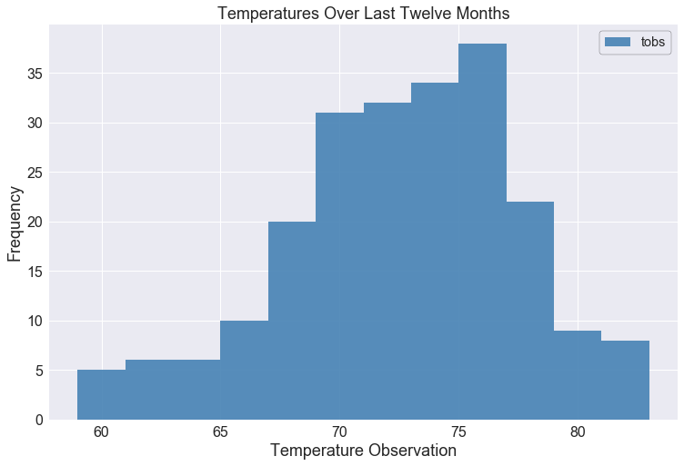
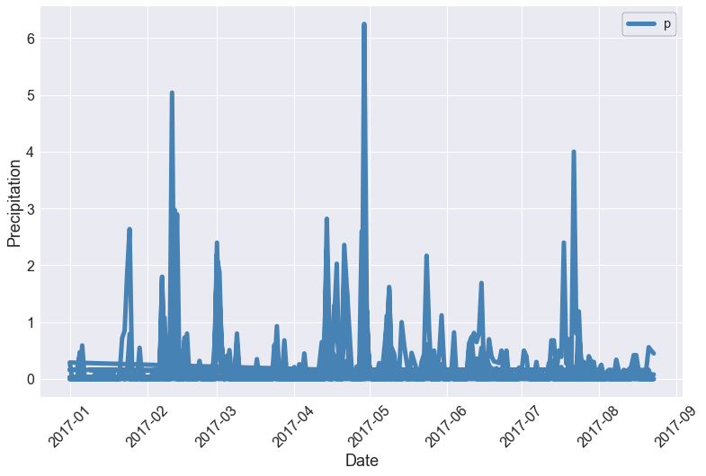
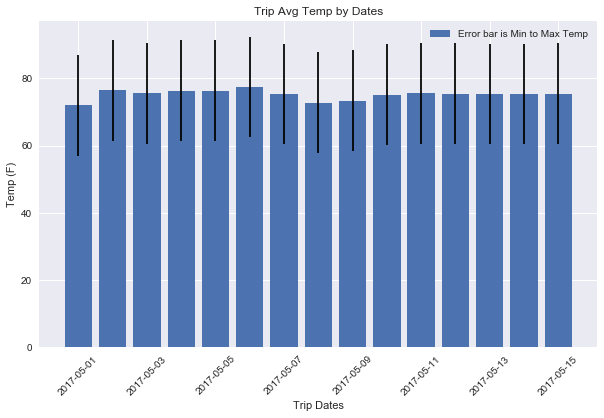
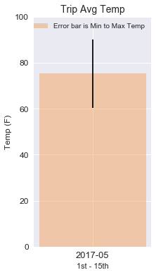

<!--lint disable no-heading-punctuation-->
<!--lint enable no-heading-punctuation-->

I decided to plan a long holiday vacation in Honolulu, Hawaii! In order to plan my trip effectively, I decided to do some climate analysis on the area beforehand.  In fact, I created a climate analysis api.

## Step 1 - Data Engineering

Here I used Python and Pandas to inspect the content of my weather data CSV files and cleaned the data.

All of this takes place in my Jupyter notebook titled `data_engineering.ipynb`.

---

## Step 2 - Database Engineering

Next I used SQLAlchemy to model the table schemas and created a sqlite database for your tables.

This took place in a Jupyter Notebook called `database_engineering.ipynb`.

---

## Step 3 - Climate Analysis and Exploration

Here I used Python and SQLAlchemy to do basic climate analysis and data exploration on my weather station tables. You can find this work in my Jupyter Notebook file called `climate_analysis.ipynb`.

---

## Step 4 - Climate App

After completing my initial analysis, I designed a Flask api based on the queries that I developed.

Below are the routes that I made:

### Routes

* `/api/v1.0/precipitation`

  * Query for the dates and temperature observations from the last year.

* `/api/v1.0/stations`

  * Return a json list of stations from the dataset.

* `/api/v1.0/tobs`

  * Return a json list of Temperature Observations (tobs) for the previous year

* `/api/v1.0/<start>` and `/api/v1.0/<start>/<end>`

  * Return a json list of the minimum temperature, the average temperature, and the max temperature for a given start or start-end range.

 * To view the code in Python that I utilized to plot the charts refer to https://github.com/bogordon86/Hawaii-Climate-Analysis/blob/master/climate-analysis.md.
 
 Here are the results:
 
 * The average rain per month:
 
 The average temps from last year during my proposed trip dates by day (May 1-15th).
 
 Here is the cumulative average temp for the trip date range.
 
 
 
